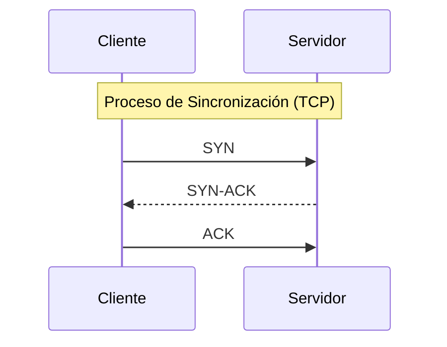

---

###  Bitácora de felipe aguilar

##  1. Comparativa de Arquitecturas: OSI vs TCP/IP

Para gestionar la seguridad, es vital entender cómo se procesan los datos en cada nivel.

| Nivel OSI | Concepto | Modelo TCP/IP | Responsabilidad | Casos de Uso |
| :--- | :--- | :--- | :--- | :--- |
| 7 | **Aplicación** | Aplicación | Interfaz con el software final. | SSH, Outlook, Spotify |
| 6 | **Presentación** | Aplicación | Traducción y encriptación de datos. | TLS/SSL, JSON |
| 5 | **Sesión** | Aplicación | Sincronización y persistencia. | SQL, NFS |
| 4 | **Transporte** | Transporte | Segmentación y fiabilidad (puertos). | TCP, UDP |
| 3 | **Red** | Internet | Determinación de rutas y lógica (IP). | IPv4, BGP |
| 2 | **Enlace** | Acceso a Red | Transferencia de tramas (física). | Ethernet, ARP |
| 1 | **Física** | Acceso a Red | Señalización eléctrica o lumínica. | Cobre, SFP |

---

##  2. Nivel de Acceso (Capa 2: Enlace)

### Direccionamiento Físico (MAC)
* **Definición:** Identificador hexadecimal de 48 bits grabado en el hardware (NIC).
* **Función:** Permite la comunicación dentro de un mismo segmento de red local.
* **Limitación:** Los routers no permiten el paso de tráfico basado solo en MAC fuera de la subred.

### MAC Spoofing & Manipulación
Técnica para modificar la identidad física de un equipo para:
1.  Saltar firewalls basados en "White-listing" de hardware.
2.  Interceptar paquetes en redes inalámbricas.
3.  Efectuar ataques de **Man-in-the-Middle**.

### Infraestructura de Conmutación (Switches)
* Un Switch no inspecciona paquetes IP; trabaja con tramas.
* **Ataques de Poisoning:** Alteración de tablas de caché (ARP/DNS/DHCP) para desviar el tráfico.
* **Defensa:** Uso de **802.1X** para autenticación de puertos.

---

##  3. Nivel de Internet (Capa 3: Red)

### Protocolo IP (Direccionamiento Lógico)
Las direcciones IP son la base del ruteo global.
* **Ámbitos de aplicación:** Servicios de correo, bases de datos remotas, y resolución de dominios web.
* **Segmentación:** El uso de máscaras de subred permite dividir la red para aumentar la seguridad.

> [!NOTE]
> Un Switch actúa como un policía de tráfico local; un Router es el mapa para salir a otras ciudades (redes).

---

##  4. Transporte y Control de Flujo (Capa 4)

### Gestión de Puertos Lógicos
Contamos con un espectro de **65,536 puertos** para diferenciar servicios.

| Puerto | Servicio Crítico | Uso |
| :--- | :--- | :--- |
| 22 | SSH | Túneles de administración |
| 443 | HTTPS | Tráfico web cifrado |
| 53 | DNS | Traducción de nombres |
| 3306 | MySQL | Bases de datos |
| 3389 | RDP | Escritorio Remoto |

### Mecanismos: TCP vs UDP
* **TCP (Transmission Control Protocol):** Robusto, garantiza que el dato llegue mediante el **3-Way Handshake**.
* **UDP (User Datagram Protocol):** Prioriza la latencia baja; no reintenta envíos (ideal para streaming).

---

## 5. Auditoría de Seguridad y Pentesting

### Perfiles de Ciberseguridad

* **Hacker Ético (White Hat):** Profesionales con permiso para hallar y corregir brechas.
* **Atacante (Black Hat):** Actores maliciosos que buscan lucro o sabotaje.
* **Gray Hat:** Actúan sin permiso, pero suelen tener una ética voluble (pueden o no dañar).
* **Insider:** La mayor amenaza; personal interno con privilegios de acceso.

### Metodología de un Pentest Profesional

1. **Passive Reconnaissance:** Búsqueda de información pública.
2. **Escaneo Activo:** Detección de servicios con `Nmap`.
3. **Vulnerability Analysis:** Identificación de debilidades (Flaws).
4. **Explotación:** Uso de un **Exploit** para inyectar un **Payload**.
5. **Persistencia:** Mantener el acceso mediante puertas traseras legales.

---

## 6. Vectores de Ataque por Capa OSI

La clasificación de ataques permite diseñar una **Defensa en Profundidad**.

| Nivel | Amenaza Común | Objetivo |
| --- | --- | --- |
| **Capa 7** | SQL Injection | Bases de datos |
| **Capa 6** | SSL Stripping | Datos en texto plano |
| **Capa 5** | Session Fixation | Cuentas de usuario |
| **Capa 4** | SYN Flood | Denegación de Servicio (DoS) |
| **Capa 3** | IP Spoofing | Evasión de ACLs |
| **Capa 2** | ARP Poisoning | Intercepción de tráfico |
| **Capa 1** | Wiretapping | Espionaje físico |

---

## 7. Conceptos de Operación

* **Zero-Day:** Falla de seguridad sin parche disponible.
* **SIEM:** Centralización de logs para monitoreo proactivo.
* **Shodan:** Herramienta para localizar activos críticos expuestos a la red pública.
* **MFA:** Protección de identidad mediante tres factores: *Lo que sabes, lo que tienes y lo que eres.*

---

