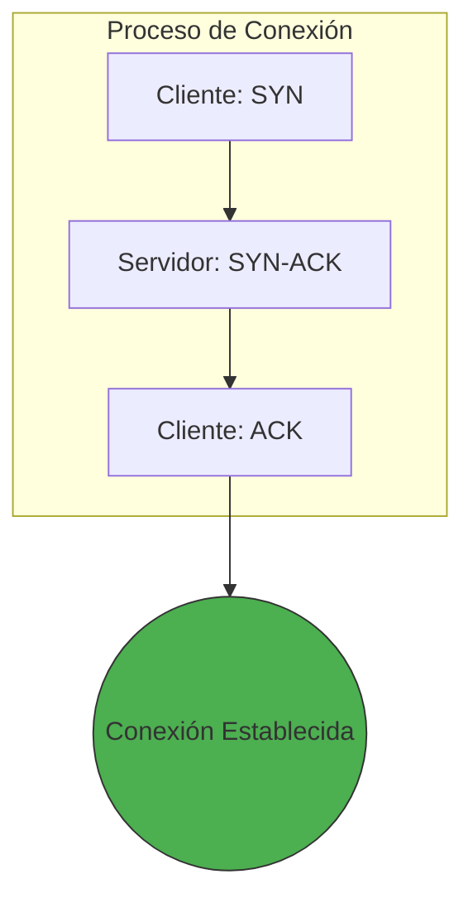
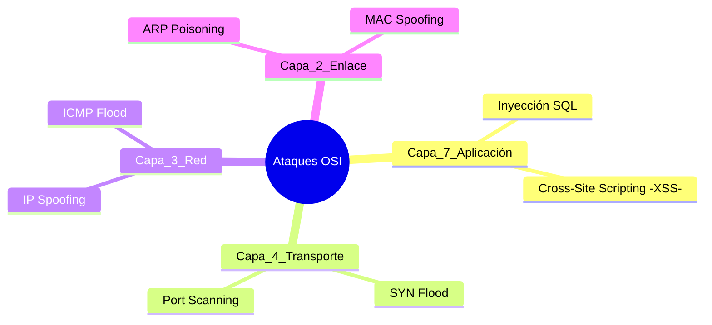

### Bitácora de Ciberseguridad: Gestión y Protocolos
**Por:** Felipe Adahir Aguilar Chan  
**Repositorio:** Seguridad-de-Datos

---

##1. Fundamentos de la Seguridad (Pilares)

En lugar de ver la seguridad como un solo concepto, la dividimos en tres objetivos críticos que deben protegerse simultáneamente:


1. **Privacidad (Confidencialidad):** Blindar el acceso para que solo los usuarios autorizados visualicen la información.
2. **Consistencia (Integridad):** Asegurar que los datos permanezcan inalterados y exactos desde su origen hasta su destino.
3. **Continuidad (Disponibilidad):** Garantizar que los recursos sean funcionales siempre que el negocio lo requiera.

> [!NOTE]
> **Balance del Sistema:** Un sistema ideal equilibra estos pilares con la **Usabilidad** (facilidad de uso) y la **Funcionalidad** (qué tanto hace el sistema).

---

##2. El Flujo de Datos: Interacción de Modelos

Para entender cómo viaja la información y dónde fallan los sistemas, comparamos las arquitecturas OSI y TCP/IP:

| Jerarquía | Capa OSI | Enfoque TCP/IP | Responsabilidad Clave |
| :--- | :--- | :--- | :--- |
| **Alta** | Aplicación, Presentación, Sesión | **Aplicación** | Procesos de red, cifrado y control de sesiones. |
| **Media** | Transporte | **Transporte** | Comunicación extremo a extremo (Puertos). |
| **Baja** | Red | **Internet** | Encaminamiento y direccionamiento lógico (IP). |
| **Física** | Enlace y Física | **Acceso a Red** | Conexión física y direccionamiento de hardware (MAC). |

---

##3. Protocolos de Transporte y Conectividad

###TCP: El Protocolo de Confianza
Para asegurar que los datos lleguen completos, TCP utiliza un **Apretón de Manos (Handshake)** antes de enviar información:



* **UDP:** A diferencia de TCP, prioriza la velocidad (Streaming, Gaming) sacrificando la confirmación de entrega.

---

##4. Ecosistema de Amenazas y Hacking

El mundo del hacking se define por la **ética** y el **propósito** del actor:

* **Auditores Éticos (White Hat):** Fortalecen defensas mediante pruebas autorizadas.
* **Ciberdelincuentes (Black Hat):** Atacan con fines de lucro o espionaje.
* **Hacktivistas:** Buscan impacto social o político a través de ataques digitales.
* **Insiders:** Usuarios internos que abusan de sus privilegios (la amenaza más difícil de detectar).

### Metodología de Auditoría (Pentesting)

Un análisis profesional no es aleatorio, sigue estas fases:

1. **Reconocimiento:** Recolección pasiva y activa de datos.
2. **Escaneo:** Uso de herramientas como `Nmap` para hallar servicios.
3. **Explotación:** Aprovechar una **Vulnerabilidad** mediante un **Exploit**.
4. **Post-Explotación:** Escalada de privilegios y persistencia.

---

## 5. Análisis del Riesgo Digital

El riesgo es una medida de probabilidad. Se define por la interacción de tres elementos:

$$Riesgo = (Amenaza \times Vulnerabilidad) \times Impacto$$

* **Vulnerabilidad:** El punto débil (ej. una contraseña por defecto).
* **Amenaza:** El agente que puede dañarnos (ej. un Ransomware).
* **Impacto:** El daño real sufrido (ej. 24 horas de operación detenida).

---

## 6. Mapa de Ataques por Capas (Modelo OSI)

He clasificado las amenazas según el nivel donde operan para facilitar su mitigación:



| Capa | Ataque | Mitigación Recomendada |
| --- | --- | --- |
| **L7** | **Inyección de Código** | Validación estricta de formularios y WAF. |
| **L6** | **SSL Stripping** | Implementar HSTS y certificados TLS modernos. |
| **L4** | **Secuestro de Sesión** | Uso de tokens únicos y cifrado de extremo a extremo. |
| **L2** | **Ataques de Switch** | Port Security y segmentación de VLANs. |

---

## 7. Glosario de Operaciones

* **Zero-Day:** Vulnerabilidad recién descubierta sin solución técnica.
* **Payload:** El código dañino que se transporta dentro de un exploit.
* **MFA:** Autenticación que requiere *algo que sabes*, *algo que tienes* y *algo que eres*.
* **SIEM:** Software que monitorea logs para alertar sobre comportamientos inusuales.

```
