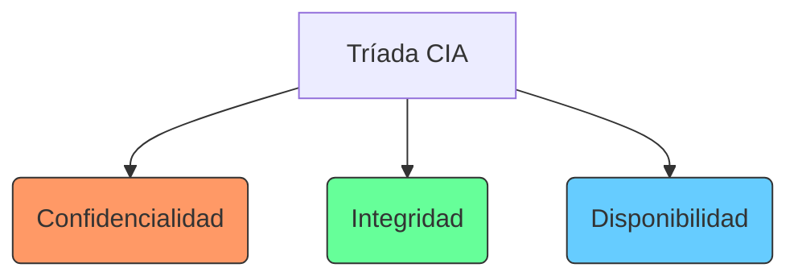
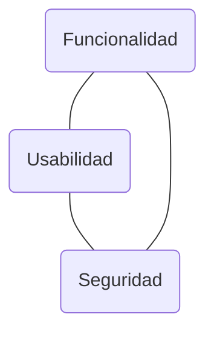

# 🛡️ Tarea #997: Conceptos Básicos de Seguridad Informática

**Alumno:** Felipe Adahir Aguilar Chan  
**Materia:** Seguridad de la Información  
**Fecha:** 23 de febrero de 2026

---

## 1. 🔺 La Tríada CIA
La base de cualquier estrategia de seguridad se apoya en tres pilares fundamentales. Si uno falla, la seguridad de la información se ve comprometida.

* **Confidencialidad:** Prevenir la divulgación no autorizada de información.
* **Integridad:** Asegurar que los datos no sean alterados de forma malintencionada o accidental.
* **Disponibilidad:** Garantizar que los sistemas y datos estén accesibles cuando se requieran.

---

## 2. ⚖️ Triángulo de Usabilidad, Seguridad y Funcionalidad
En ciberseguridad, existe un "trade-off" o equilibrio necesario. No se puede tener el máximo en los tres puntos simultáneamente.

> [!TIP]
> **Regla de oro:** A mayor seguridad, generalmente menor es la usabilidad para el usuario final. El objetivo es encontrar el punto de equilibrio óptimo.

---

## 3. 📉 Gestión de Riesgos
El riesgo no es un concepto aislado, sino el resultado de la interacción de varios factores:

### La Ecuación del Riesgo
$$Riesgo = (Amenaza 	imes Vulnerabilidad) 	imes Impacto$$

| Concepto | Definición |
| :--- | :--- |
| **Vulnerabilidad** | Una debilidad o "hueco" en el sistema (ej. software sin parches). |
| **Amenaza** | El evento externo que puede explotar la debilidad (ej. un hacker o un malware). |
| **Impacto** | El nivel de daño sufrido si la amenaza se concreta (ej. pérdida económica). |
| **Riesgo** | La probabilidad de que ocurra el evento negativo. |

---

## 4. 🔐 Autenticación Multifactor (MFA)
El MFA añade capas de protección para asegurar que quien accede es quien dice ser. Se basa en tres factores de verificación:

- [ ] **Algo que sabes:** Contraseñas, PINs o preguntas de seguridad.
- [ ] **Algo que tienes:** Tokens físicos, llaves USB o códigos vía SMS/App.
- [ ] **Algo que eres:** Biometría (Huella, rostro, iris).

---

## 📖 Resumen de Conceptos (Bitácora)

| Término | Definición Breve |
| :--- | :--- |
| **CIA Triad** | Modelo de protección de datos (Confidencialidad, Integridad, Disponibilidad). |
| **Riesgo** | Posibilidad de que un incidente ocurra y su impacto. |
| **MFA** | Método de acceso que requiere más de una prueba de identidad. |
| **Impacto** | Severidad de las consecuencias tras un ataque. |

---

## 💡 Ejemplo Práctico: Ataque de Phishing
Para ilustrar la relación:
1.  **Vulnerabilidad:** Falta de capacitación del personal (abren correos sospechosos).
2.  **Amenaza:** Un atacante enviando un correo falso de "actualización de contraseña".
3.  **Riesgo:** Alta probabilidad de robo de credenciales en una empresa sin MFA.
4.  **Impacto:** Acceso no autorizado a la base de datos de clientes (Pérdida de **Confidencialidad**).

---
*Documento generado para la bitácora de sistemas - 2026*
